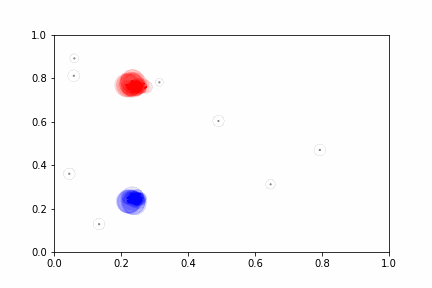

# Experimental d-FuzzStream: Dispersion-Based Fuzzy Data Stream Clustering

Implementation of the fuzzy data stream clustering algorithm from the article [d-FuzzStream: A Dispersion-Based Fuzzy Data Stream Clustering](https://ieeexplore.ieee.org/document/8491534).
Original Python implementation, as well as, additional information can be found in this [repo]().

This implementation facilitates experiments over the original implementation because of the following aspects:
* Allows different functions to be used when calculating distance, membership and merge. 
  * Useful to experiment different combinations of these functions. 
* Computes classes present in the examples. 
  * Enables a semisupervised approach.
  * Possibility to calculate clustering metrics based on classes (e.g. Purity, Rand Index).
* Calculate metrics regarding the summary structures: 
  * *Creations* -> number of structures created.
  * *Absorptions* -> number of examples assigned to all structures.
  * *Removals* -> number of structures removed.
  * *Merges* -> number of structures merged.
## Demonstration

Summary of the [Bench1_11K](https://raw.githubusercontent.com/CIG-UFSCar/DS_Datasets/master/Synthetic/Non-Stationary/Bench1_11k/Benchmark1_11000.csv) dataset using all default options.
Colors (Blue, Red and Grey) represent their classes.



```
{'creations': 8333, 'absorptions': 2667, 'removals': 3589, 'merges': 4676}
```
## Requirements

- [Python 3](https://www.python.org/downloads/)

To run examples and generate graphics:
- [Pandas](https://pandas.pydata.org/docs/getting_started/install.html)
- [Matplotlib](https://matplotlib.org/stable/users/installing/index.html)

## How to use it
Follow the original implementation steps with the addition of three parameters:
* *distance_function* (default: euclidean distance) -> function to calculate distance between two values.
* *membership_function* (default: fuzzy c-means membership) -> function that distances and calculate memberships.
* *merge_function (default: fuzzy dissimilarity)* -> function to calculate and merge summary structures

All options have default values.

Example on how to change functions:
```python
from d_fuzzstream import DFuzzStreamSummarizer


class ExampleFunction:
  def memberships(distances, fuzzy_factor):
    # Do Something
    return []
    
def merge_function(fmics, threshold):
  # Do Something
  return fmics

summarizer = DFuzzStreamSummarizer(
  # Using lambda
  distance_function=lambda v1, v2: v1 - v2,
  # Using class method
  membership_function=ExampleFunction.memberships,
  # Using function
  merge_function=merge_function
)
```

To summarize examples, passes one example at a time to summarizer with its respective tag and timestamp.
```python
from d_fuzzstream import DFuzzStreamSummarizer

summarizer = DFuzzStreamSummarizer()
summarizer.summarize([0,1], 'red', 1)
```

**This is not a thread-safe class, no more than 1 example should be passed to summarize method at a time.**

To get a copy of the summary structures call the method:
```
summarizer.summary()
```
Structure can be used later to map to a dataframe. Example:
```
summary = {'x': [], 'y': [], 'weight': []}

for fmic in summarizer.summary():
    summary['x'].append(fmic.center[0])
    summary['y'].append(fmic.center[1])
    summary['weight'].append(fmic.m)
    summary['class'].append(max(fmic.tags, key=fmic.tags.get)) # Get tag with greatest value
```

To get the metrics:
```
summarizer.metrics
```

## How to run examples
Simple example, without animation:
```commandline
python3 example/example.py
```
Example with animation:
```commandline
python3 example/example_with_animation.py
```